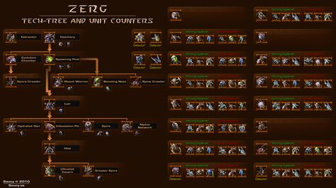

# Zerg StarCraft2Agent 

# Purpose of Implementation
This implementation is a StarCraft 2 building order to create a zerg agent 
The purpose was to build all the essential buildings in order to obtain resources in an efficient way and to have enough Drones to build in a constant period of time, after that building queens to increase the larva production and defend the Liar, and follow series of conditions to have a balanced army in order to obtain units that can attack aerial objectives, strings units to defend and units with a faster mobility in order to cause a great harm.
# Build Order
 
•	Spawning Poll 
•	Extractor
•	Spawning Pool
•	Queen
•	Lair
•	SpineCrawler
•	Hydralisk Den
•	InfestationPit
•	Hive
•	UltraliskCavern
 

observations: The unit Queen is different because it is created as a building not as an unit.
# Morph Order
 
•	Drone 
•	Zergling
•	Hydras
•	Ultralisk
 

# Zerg Tech tree and Unit Counters 

 
# Dependencies and libraries  
•	Python 2.7+
•	PySC2
# Zerg Agent 
agent.py
# Zerg Agent video
https://youtu.be/J0Ru5nZr8SU
